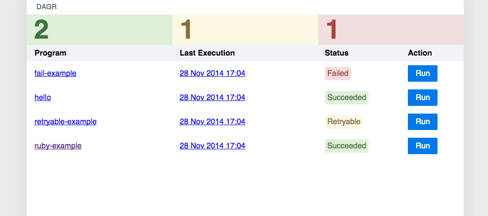
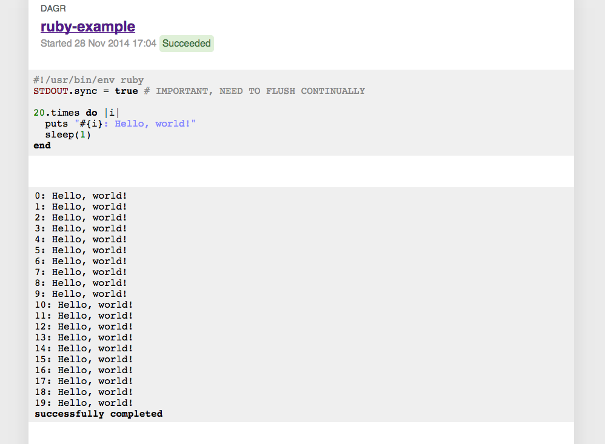

Dagr
====

Runs programs every day (in Norse mythology, Dagr is day personified).

Dagr monitors a specified git repository for programs (directories
that contain a `main` executable) and ensures each of them is executed
every day (or at any other frequency expressible in the Cron
syntax). Program output (`stderr` and `stdout` are captured and showed
on a monitoring page). A program's exit code can be used to signal to
Dagr whether a program succeeded (`0`) or failed (`2`), or whether it
should be retried after a delay (`1`). For examples please see our
[sample programs repository](https://github.com/uswitch/dagr-sample-programs).

### Configuration

If a [toml](http://github.com/toml-lang/toml) file called `dagr.toml`
is present in the same directory as main, it is expected to contain a
line in this format:

    schedule = "CRON EXPRESSION"

The Cron expression gives the schedule on which to run the program.

Valid Cron expressions are those accepted by the
[robfig/cron](https://godoc.org/github.com/robfig/cron) library.

e.g.

    schedule = "0 */5 * * * *"

would ensure the program would be run every five minutes. If the
`dagr.toml` file does not exist, the schedule defaults to `@daily`
(i.e. every day at midnight).

### Dagr Dashboard

The dashboard provides an overview of which programs are available to run, their most recent status and three counters showing how many programs succeeded or failed today.

### Execution Page

The execution page allows you to view `stderr` and `stdout` for a program- the state is updated via a websocket.

## Build

### Pre-requisites

* Go
* Zip
* Git

Dagr contains packages which are specified as `github.com/uswitch/dagr/foo` etc. When developing its helpful to ensure
you pull the code using `go get` and build using the provided `Makefile` to ensure the web resources are zipped into
the executable.

    $ export PATH=$GOPATH/bin:$PATH
    $ cd $GOPATH
    $ go get github.com/uswitch/dagr
    $ make -C src/github.com/uswitch/dagr deps
    $ make -C src/github.com/uswitch/dagr

## Run

    $ cd $GOPATH
    $ ./bin/dagr --http :8080 --repo git@github.com:uswitch/dagr-sample-programs --work /tmp/dagr-work
